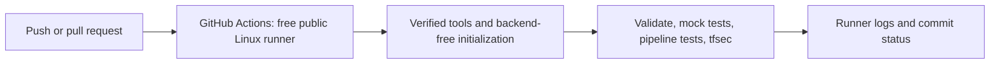
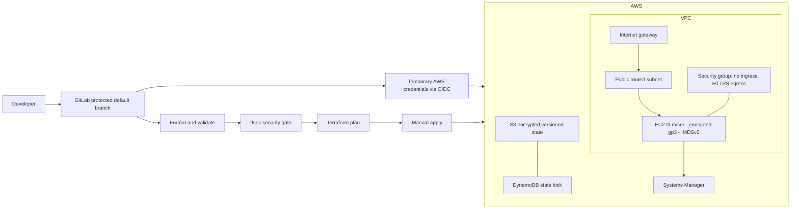

# AWS Infrastructure Delivery with Terraform and GitLab CI/CD

[](https://github.com/hundrik3/CI-CD-prac/actions/workflows/validate.yml)

A portfolio implementation of [DevCloudNinjas project 26](https://github.com/DevCloudNinjas/DevOps-Projects/tree/main/project-26-terraform-gitlab-cicd). Terraform provisions an AWS network and an SSM-managed EC2 instance; GitLab CI validates, scans, plans, and offers manual apply and destroy jobs.

**Status:** local checks and [GitHub-hosted CI](https://github.com/hundrik3/CI-CD-prac/actions/runs/37472609991) passed. AWS deployment and a hosted GitLab pipeline are not verified. See [validation evidence](docs/validation.md). No AWS resources were created during implementation.

## Free portfolio workflow

The [GitHub Actions workflow](.github/workflows/validate.yml) runs on pushes to `main`, pull requests and manual dispatch. It uses standard hosted Linux runners in this public repository, read-only permissions and no AWS credentials. It validates both Terraform configurations, runs mock-plan tests and GitLab pipeline-control tests, and enforces the documented security gate. It never deploys AWS resources.

Read the [case study](docs/case-study.md) for the problem, decisions and verified scope. Actual GitHub runner results are available from the badge above; local test success alone does not prove a hosted run passed. The GitLab delivery pipeline is retained to implement the original assignment.



## Architecture



The instance uses a public IPv4 for outbound SSM connectivity but accepts no inbound connections. No SSH, load balancer, NAT Gateway, application, or Kubernetes cluster is needed for this infrastructure-delivery lab.

## Local checks

Required: Terraform 1.11.4, tfsec 1.28.14, Python 3 with PyYAML; AWS CLI 1.38.38 for live checks.

From this checkout, run `sh scripts/install-tools.sh`, then `export PATH="/workspace/tooling/bin:/workspace/tooling/venv/bin:$PATH"`. The installer targets Linux amd64 and verifies upstream checksums. The AWS provider is pinned through committed dependency lockfiles.

```sh
terraform fmt -check -recursive
terraform -chdir=infra init -backend=false -lockfile=readonly
terraform -chdir=bootstrap init -backend=false -lockfile=readonly
terraform -chdir=infra validate
terraform -chdir=bootstrap validate
terraform -chdir=infra test
python -m unittest discover -s tests -v
tfsec infra --minimum-severity HIGH
tfsec bootstrap --minimum-severity HIGH
```

Terraform tests use a mocked AWS provider and do not create cloud resources. They test generated plans and security invariants, not live AWS behavior.

## Deploy and clean up

Read the [deployment runbook](docs/runbook.md) and [design decisions](docs/decisions.md) before provisioning. Obtain explicit approval for AWS costs, use temporary credentials, and review every plan. The GitHub repository stores the project; `.gitlab-ci.yml` runs only after importing or mirroring it into a GitLab project.

Estimated us-east-1 cost: approximately $0.018/hour or $12–13/month continuously, plus state storage, requests and data transfer; pricing, credits and taxes vary. Terminating EC2 does not delete the versioned state bucket. See [cost details](docs/costs.md) and the runbook for complete cleanup.
