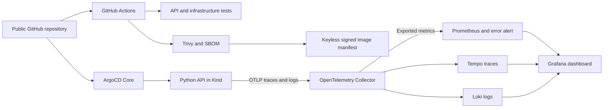

# Observable GitOps Delivery Platform

[](https://github.com/hundrik3/CI-CD-prac/actions/workflows/application.yml)
[](https://github.com/hundrik3/CI-CD-prac/actions/workflows/validate.yml)

A local DevOps portfolio platform that connects a Python API, Docker, Kubernetes/ArgoCD, OpenTelemetry observability, progressive delivery and supply-chain verification. It runs without AWS, a paid cluster or permanent access keys. The existing Terraform/GitLab AWS lab remains available as a separate, optional infrastructure exercise.

**Verified:** [fresh GitHub-hosted end-to-end run](https://github.com/hundrik3/CI-CD-prac/actions/runs/37601631088) passed, including GitOps recovery, real telemetry, vulnerability checks and keyless signature verification. Local Git promotion to v2 and revert to v1 were also verified. [Project 54 local validation](docs/progressive-delivery-validation.md) passed canary promotion, manual and metric-based abort, zero-traffic rejection and complete cleanup.

## What to inspect

- [Architecture and decisions](docs/architecture.md): how the components connect and why.
- [Progressive delivery](docs/progressive-delivery.md): Project 54 canary steps, real Prometheus gates, promotion and abort.
- [Code review](docs/code-review.md): corrections and accepted limitations.
- [Local runbook](docs/local-runbook.md): setup, tests, GitOps, troubleshooting and complete cleanup.
- [Platform validation](docs/platform-validation.md): actual outcomes, reproducible checks and limits.
- [Security and signatures](security/README.md): scanner policy, SBOM and signed image-manifest verification.
- [Case study](docs/platform-case-study.md): the engineering problem, implementation and failure investigation.
- [Original Terraform project](docs/terraform.md): preserved IaC, backend bootstrap and GitLab delivery pipeline.

## Architecture



ArgoCD manages the app's deployment and services from Git. The observability services run in Docker Compose and connect to Kind across an IPv4 bridge. A generated runtime Endpoints object discovers the collector IP; it is not a secret or a Git-controlled cloud resource. The application image is built locally and loaded into Kind, so no registry account is needed. This demonstrates GitOps configuration delivery, not automatic promotion from a production registry.

## Quick start: Linux amd64

Requirements: Docker with Compose, Python 3.12, curl, Make and approximately 6 GiB available RAM. A nested Docker environment using native snapshots may require substantially more disk than a normal Linux host; see the runbook.

```sh
make tools
make validate
make compose-up
make compose-check
make compose-down
make gitops-up
make gitops-check
make gitops-down
```

Run from the repository root. `make tools` installs SHA256-verified tools in `.local/bin` and dependencies in `.local/venv`; both are ignored by Git. GitOps follows this repository's `main` branch. Forks must change the repository allowlist and Application source URL together.

For standalone Compose use the loopback app port 8080; GitOps mode uses 8081. Metrics, dashboards, traces and logs are also bound only to loopback. See the runbook for local access commands. No cloud resources are provisioned by these targets.

## Checks and evidence

The application workflow builds the actual image, checks HTTP behavior and exported metrics/traces/logs/alerts, verifies ArgoCD reconciliation, scans the image and generates an SPDX SBOM. A separate trusted-main job signs and verifies an image manifest through GitHub OIDC and Sigstore, then checks that tampering is rejected. Small evidence artifacts expire after one day; persistent outcomes are summarized in the documentation and run logs.

The Terraform workflow remains credential-free and uses mocked AWS providers. Live AWS deployment, live GitLab execution and OpenTofu compatibility are not claimed. Documentation distinguishes verified runs from pending or unavailable checks.

## Source assignments

| Project | Implementation |
|---|---|
| [26: Terraform + GitLab CI/CD on AWS](https://github.com/DevCloudNinjas/DevOps-Projects/tree/main/project-26-terraform-gitlab-cicd) | Preserved Terraform modules, S3/DynamoDB backend and GitLab pipeline |
| [50: ArgoCD GitOps Home Lab](https://github.com/DevCloudNinjas/DevOps-Projects/tree/main/project-50-argocd-gitops-home-lab) | Kind, ArgoCD Core, sync and replica drift recovery |
| [51: OpenTelemetry Observability Home Lab](https://github.com/DevCloudNinjas/DevOps-Projects/tree/main/project-51-opentelemetry-observability-home-lab) | One app, OTLP traces/logs, Prometheus, Tempo, Loki and Grafana |
| [54: Progressive Delivery Home Lab](https://github.com/DevCloudNinjas/DevOps-Projects/tree/main/project-54-progressive-delivery-home-lab) | Argo Rollouts, 20/60/100% steps, manual promotion/abort and metric-based rejection |
| [53: Supply Chain Security Lab](https://github.com/DevCloudNinjas/DevOps-Projects/tree/main/project-53-supply-chain-security-lab) | Trivy, Syft SPDX SBOM and Cosign keyless signed image manifest |

This is a local learning platform. Anonymous read-only Grafana access, intentional error endpoints and ephemeral telemetry storage are deliberate lab choices, not production recommendations. Paid AWS deployment is outside the default workflow.
