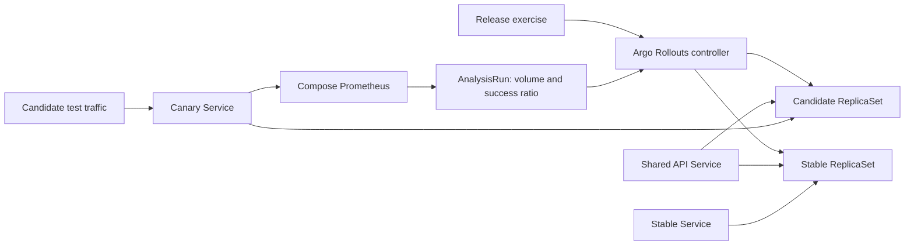

# Progressive delivery: Project 54

Source: [DevCloudNinjas Project 54](https://github.com/DevCloudNinjas/DevOps-Projects/tree/main/project-54-progressive-delivery-home-lab).

## Problem and design

A ready pod can still fail business requests. This lab keeps the previous release available while a candidate receives a small share of traffic. Argo Rollouts v1.10.0 controls a five-replica API in the dedicated `progressive-delivery` namespace of the existing `portfolio` Kind cluster. It does not replace the ArgoCD-managed Deployment in `portfolio`.

The controller install is pinned to an upstream release and its manifest SHA256 is checked before application. The existing API image is loaded locally; releases change `APP_VERSION` in the pod template. The intentionally broken release also sets `APP_FAIL_WORK=true`, producing HTTP 500 for valid `/work` requests while readiness stays healthy. There is no new image registry, AWS resource or paid API.



The shared NodePort Service uses pod-count-based routing. Requested weights are **approximate**, not exact per-request guarantees; there is no ingress, service mesh or weighted traffic router. Separate stable/canary Services receive controller-managed ReplicaSet hash selectors. The baseline uses five pods; transient surge can add one pod. The check records the actual counts and samples 100 independent HTTP connections, asserting both versions are observed rather than demanding an exact 20% distribution.

The rollout steps are 20%, manual pause, inline analysis, 60%, manual pause, 100%. At the first pause there is one candidate, so the canary Service's Prometheus scrape is coherent. This simple scrape design is **not** suitable for aggregating counters across multiple load-balanced candidate pods; production would scrape each pod separately and group by rollout revision.

The analysis requires at least 20 `/work` requests and at least 99% successful responses, across three measurements five seconds apart. It starts after a ten-second delay. Metrics are scoped to the dedicated `release-canary` job and business route. Empty series resolve to zero and fail closed. These are cumulative counters for an isolated, fresh candidate, not a production rolling-window SLO. Prometheus and controller communication stay on local Docker/Kubernetes networks. A generated, non-secret Endpoints object discovers Prometheus's bridge IP.

## Run

Use Linux amd64, Docker Compose, Python 3.12, curl and Make. Start from the repository root. Allow roughly 6 GiB RAM and at least 25 GiB free disk in a nested Docker environment; normal hosts usually need less disk. Do not run this on a production cluster.

```sh
make tools
make validate
make compose-down
make gitops-up
make gitops-check
make rollouts-up
make rollouts-check
```

`rollouts-up` requires the private `.local/kubeconfig` with context `kind-portfolio`. It installs the controller and CRDs, applies the optional lab, and enables the dedicated Prometheus scrape through `compose.rollouts.yaml`. A repeated `rollouts-up` reapplies the v1 template; use `rollouts-check` to reset and complete the known baseline if a prior exercise was interrupted. Full promotion is used only for this explicit baseline reset, never for the successful candidate's analysis.

`rollouts-check` generates actual traffic and checks:

1. Initial v1 is healthy.
2. v2 pauses at 20%; stable and canary Services return different versions, and the shared Service reaches both.
3. Actual Prometheus analysis passes before the 60% pause.
4. Explicit promotion completes v2.
5. Manual abort rejects a third candidate, scales it down and preserves v2 on the shared Service.
6. A ready but broken candidate returns HTTP 500; the controller automatically aborts on failed analysis, scales down the candidate and preserves working v2.
7. A fresh candidate with no business traffic fails the sample-volume gate.
8. The known v1 baseline is restored.

The generated `.local/rollouts-evidence.json` includes timestamps, selector hashes, ReplicaSet counts and real AnalysisRun measurements. A failed check exits nonzero; expected candidate rejection is asserted as a successful safety check. The checker applies temporary release templates imperatively within this lab. These exercises are **not** claimed as GitOps release promotion. The original ArgoCD application remains Git-managed.

## Inspect and operate manually

```sh
export KUBECONFIG="$PWD/.local/kubeconfig"
.local/bin/kubectl -n progressive-delivery get rollouts,rs,pods,services,analysisruns
.local/bin/kubectl -n progressive-delivery get rollout release-api -o yaml
.local/bin/kubectl -n progressive-delivery get analysisruns -o yaml
.local/bin/kubectl -n argo-rollouts logs deployment/argo-rollouts --tail=50
```

To access the shared API, run this in a separate terminal, then request `http://127.0.0.1:8084/`:

```sh
.local/bin/kubectl -n progressive-delivery port-forward --address 127.0.0.1 service/release-api 8084:8080
```

Port-forward picks one pod, so it cannot demonstrate traffic distribution. The automated checker uses independent requests to the node's bridge IP and NodePorts 30081 (stable), 30082 (candidate) and 30083 (shared). Those NodePorts are not mapped to public host ports; the existing 8081 host mapping still belongs to the original GitOps app.

At a manual canary pause, promote using the same status patch as the official optional plugin:

```sh
.local/bin/kubectl -n progressive-delivery patch rollout release-api --subresource=status --type=merge -p '{"status":{"pauseConditions":null}}'
```

To abort:

```sh
.local/bin/kubectl -n progressive-delivery patch rollout release-api --subresource=status --type=merge -p '{"status":{"abort":true}}'
```

Abort restores stable traffic but does not rewrite `spec.template`. Restore the known-good desired template afterward; the automated checker demonstrates this. Do not clear an abort blindly and retry a broken candidate.

If analysis errors, inspect its metric results, Prometheus target `release-canary`, candidate `/metrics`, and runtime `prometheus` Endpoints before changing thresholds. Missing metrics must not be treated as success. If the previous checker failed, evidence from an earlier successful invocation does not validate that failed run.

## Cleanup

Remove only this lab and restore the default observability configuration:

```sh
make rollouts-down
```

This removes its two namespaces. Cluster-scoped Argo Rollouts CRDs and RBAC remain until complete cluster deletion; the helper deliberately does not delete shared CRDs blindly. For complete teardown, including CRDs, controller RBAC, telemetry storage and private kubeconfig:

```sh
make gitops-down
make compose-down
```

No global Docker prune is used. Cached images and tools remain. No cloud resources are created by any of these commands.

## Validation evidence

Actual results and limitations are recorded in [Project 54 validation](progressive-delivery-validation.md). The existing application workflow exercises this lab on trusted-main runs after the original GitOps checks and uploads small evidence artifacts. PRs retain application checks but skip the full cluster/signing stages.
